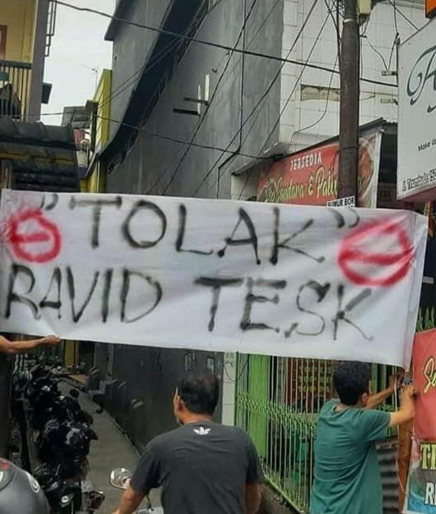
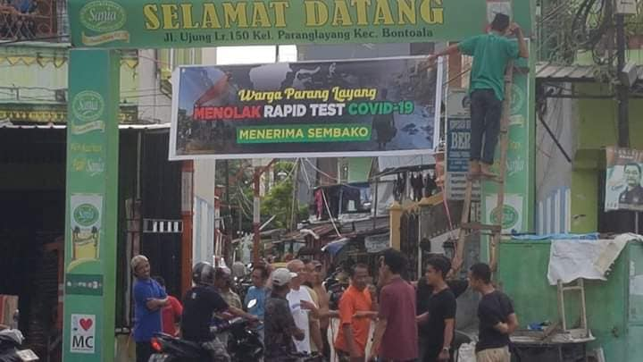

# Ravitprob

This repository is dedicated for my Probability and Statistics (FOC213) course project

Project reports: https://docs.google.com/document/d/1wQ-dqfQUWRLcPbEm9yqaYLLvgtoTi8Hhe2XyXGAzw5Y/edit?usp=sharing

## Development

The program are developed using [QtCreator](https://www.qt.io/product/development-tools) IDE

## License

Licensed under [MIT License](LICENSE)
